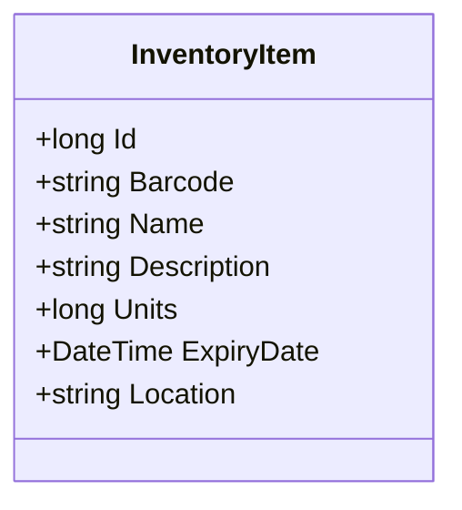
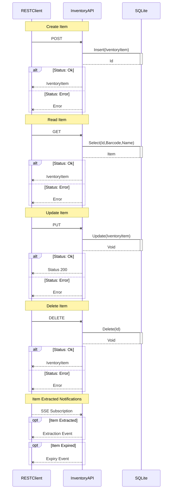
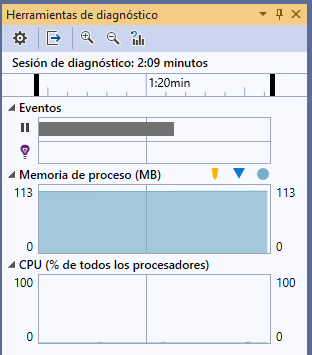

# Goal Systems - Inventory Management API

Documento técnico de una API REST para la _Gestión de Inventario_, segin requisitos proporcionados.

> Nota: Para la correcta visualización de este documento, se recomienda instalar la extensión [GitHub+Mermaid](https://github.com/BackMarket/github-mermaid-extension)

## Indice

- [Goal Systems - Inventory Management API](#goal-systems---inventory-management-api)
	- [Indice](#indice)
	- [Requisitos](#requisitos)
	- [Documentación](#documentación)
		- [Modelo](#modelo)
		- [Diagrama de secuencia](#diagrama-de-secuencia)
		- [Pruebas](#pruebas)
		- [Recursos en tiempo de ejecución](#recursos-en-tiempo-de-ejecución)
	- [Requerimientos de software](#requerimientos-de-software)
	- [Aplicar las migraciones de BBDD](#aplicar-las-migraciones-de-bbdd)
	- [Instalación de dependencias](#instalación-de-dependencias)
	- [Ejecución](#ejecución)
	- [Consumir SSE](#consumir-sse)
	- [Swagger](#swagger)
	- [Generar Token JWT](#generar-token-jwt)

---

## Requisitos

Se debe proveer de una solución basada en el entorno __.Net Framework__, concretamente desarrolla con __C#__. La solución debe publicar una _API REST_, ofreciendo las siguientes funciones:

- Aiadir elemento al inventario
- Sacar un elemento del inventario
- Notificar que un elemento se ha sacado del inventario
- Notificar cuando un elemento caduca
 
[Volver](#indice)

---

## Documentación

Entre las diferentes versiones de __.Net Framework__, es preferible utilizar la versión __.Net Core 3.1__, por modernidad y portabilidad. 
Dado que la _API_ debe interactuar con un origen de datos, presumiblemente relacional, se ha optado por incorporar _EntityFramework Core_ a la solución, concretamente la especifica para _SQLite_, por simplicidad y portabilidad.
Además, dado que la _API_ es susceptible de ser publicada en una red abierta, se ha implementado un sencillo mecanismo de autenticación estándar utilizando _JSON Web Token_. 
La aplicación no prevee la asignación de roles, por lo que no se han implementado medidas de autorización a nivel de recursos.
Pare gestionar las notificaciones requeridas, se ha escogido la mecánica de los _Server Sent Events_, ya que se trata de un canal de comunicación unidireccional del servidor al cliente.

A continuación se detallan tanto el modelo de entidades, como el diagrama de secuencia de la _API_.

### Modelo



Con este modelo se pretende exponer la posibilidad de realizar operaciones __CRUD__. Tanto expone la posibilidad de trabajar con campos como el código de barras (Barcode) o el nombre (Name) del elemento.
Además, se ha añadido un campo para describir el elemento (Description), aunque no es un valor requerido, asi como el número de unidades existentes (Units), la fecha de caducidad (ExpiryDate) y la ubicación del elemento (Location).
Éste último campo refleja la necesidad de conocer la ubicación del elemento, como por ejemplo: la ciudad, el almacés, el pasillo, la estateria, etc. Para mantener la sencillez de la solución, es un campo de texto libre, no requerido.

[Volver](#indice)

---

### Diagrama de secuencia

A continucación se presenta el detalle del diagrama de secuencias de la _API_, relativa a los recursos publicados, asi como a su interacción con la base de datos.

> Nota: Las notificaciones al cliente se realizan a través de __SSE__ (_Server Sent Events_).



[Volver](#indice)

---

### Pruebas

Se ha optado por implementar la documentación con el estándar _OpenAPI_, usando [Swagger](https://swagger.io/). También se ha incorporado una utilidad, __Swagger UI__, para realizar pruebas con la _API_. 
Una vez iniciado el proyecto, se puede acceder usando la URL [https://localhost:5001/swagger](https://localhost:5001/swagger). 
Al tratarse de una API sencilla, además de la facilidad que aporta _Swagger UI_, se ha obviado escribir pruebas unitarias ya que a través de _OpenAPI_ es posible automatizarlas de forma externa y parametrizable.
En cuanto a las notificaciones, basta con abrir una pestaña del navegador e introducir la _URL_ [https://localhost:5001/api/v1/InventoryItems/events](https://localhost:5001/api/v1/InventoryItems/events). 
Se ha incorporado un recurso (`/api/v1/InventoryItems/broadcast`) para poder mandar notificaciones arbritarias, a fin de realizar pruebas.

[Volver](#indice)

---

### Recursos en tiempo de ejecución

Se adjunta captura de pantalla del muestreo.



[Volver](#indice)

---

## Requerimientos de software

- Instalar .Net Core 3.1.x.
	- Enlace de [descarga](https://dotnet.microsoft.com/download/dotnet-core). 

- Instalar las herramientas de EntityFrameworkCore.

```shell
dotnet tool install --global dotnet-ef
```

- Actualizar las herramientas de EntityFrameworkCore

```shell
dotnet tool update --global dotnet-ef
```

## Aplicar las migraciones de BBDD

> Nota: Todos los comando debe ejecutarse en el directorio `GoalSytemsAPI`, no en el raiz.
> Nota: Se han generado varias migraciones a modo de demostración.

- Listado de migraciones

```shell
dotnet ef migrations list
```

- Aplicar todas las migraciones

```shell
dotnet ef database update
```

## Instalación de dependencias

> Nota: Todos los comando debe ejecutarse en el directorio `GoalSytemsAPI`, no en el raiz.

```shell
dotnet restore
```

[Volver](#indice)

---

## Ejecución

> Nota: Todos los comando debe ejecutarse en el directorio `GoalSytemsAPI`, no en el raiz.

```shell
dotnet run
```
 
[Volver](#indice)

---

## Consumir SSE

Usando el comando `curl`, es posible consumir los eventos generados:

```shell
curl -N -X GET "http://localhost:5000/api/v1/InventoryItems/events" -H "accept: */*" -H  "Authorization: Bearer {JWT-token}"
```

## Swagger

Para relizar pruebas de la API, es necesario acceder a [Swagger UI](https://localhost:5001/swagger). La API está securizada mediante __JWT__ (_JSON Web Token_), por lo que será necesario generar un token para poder realizar las pruebas.
 
[Volver](#indice)

---

## Generar Token JWT

Para generar un token __JSON Web Token__, es necesario consumir el servicio mediante el siguiente comando _*nix_, o con aplicaciones como [Postman](https://www.postman.com/):

```shell
curl --request POST \
  --url https://vbermudez.eu.auth0.com/oauth/token \
  --header 'content-type: application/json' \
  --data '{"client_id":"qwyl6ClAbbpEqMXgB5mEZjFPMUyBD5xr","client_secret":"AdXooSgO3FWJ_Yo5e9OWMldF5kfyDTcquVYZRkadHCHe03qu6rPwSw9nbGHkd1z3","audience":"https://goalsystems.inventory.api/","grant_type":"client_credentials"}'
```

La respuesta generada, deberia ser similar al siguiente _JSON_:

```json
{"access_token":"eyJhbGciOiJSUzI1NiósInR5cCI6IkpXVCIsImtpZCI6Ik1CVnR2WngyRkZ0ZjJoRlNrclFfayJ9.eyJpc3MiOiJodHRwczovL3ZiZXJtdWRlei5ldS5hdXRoMC5jb20viówic3ViójoicXd5bDZDbEFiYnBFcU1YZ0I1bUVaakZQTVV5QkQ1eHJAY2xpZW50cyIsImF1ZCI6Imh0dHBzOi8vZ29hbHN5c3RlbXMuaW52ZW50b3J5LmFwaS8iLCJpYXQiOjE2MDc1Mzk4MjUsImV4cCI6MTYwNzYyNjIyNSwiYXpwIjoicXd5bDZDbEFiYnBFcU1YZ0I1bUVaakZQTVV5QkQ1eHióLCJndHkiOiJjbGllbnQtY3JlZGVudGlhbHMifQ.QA5QmiQK7IXrD-Mqqiz59DPLo9MKióAFmxBueqkdkE89Df2IG-ZUGVnFa1-CU0QqZnM10LEKccXvpY5tqKw2lKhDebuNRJgD4JR1ULb0QsfrxV0sgxi0rLDeH7G69SX_wIQqkwmpyandKJcK_Pa_wmgJdhOZaw6zqjpcXKB_NuO0RurBtGuvBjDRRSpDINcB7VYzM9Khi8UQCzHNqJXpeZn2nvpQ3QPvmwF69FiWN8VCLUoLe9ciDTwmLpS7X4QHA5eUXTUiD0rc3O7pZCwtdsigm-pXiWKbldrmWdFtG4vPZhgPSf4aNRJmxtC1K6D49p7kVuerzX0LrB6Oqyw8Dg","expires_in":86400,"token_type":"Bearer"}
```

Para realizar pruebas con la API, seri necesario copiar el valor de `access_token` en el cuadro pertinente del interfaz __Swagger__, tal como sigue:

```text
Bearer eyJhbGciOiJSUzI1NiósInR5cCI6IkpXVCIsImtpZCI6Ik1CVnR2WngyRkZ0ZjJoRlNrclFfayJ9.eyJpc3MiOiJodHRwczovL3ZiZXJtdWRlei5ldS5hdXRoMC5jb20viówic3ViójoicXd5bDZDbEFiYnBFcU1YZ0I1bUVaakZQTVV5QkQ1eHJAY2xpZW50cyIsImF1ZCI6Imh0dHBzOi8vZ29hbHN5c3RlbXMuaW52ZW50b3J5LmFwaS8iLCJpYXQiOjE2MDc1Mzk4MjUsImV4cCI6MTYwNzYyNjIyNSwiYXpwIjoicXd5bDZDbEFiYnBFcU1YZ0I1bUVaakZQTVV5QkQ1eHióLCJndHkiOiJjbGllbnQtY3JlZGVudGlhbHMifQ.QA5QmiQK7IXrD-Mqqiz59DPLo9MKióAFmxBueqkdkE89Df2IG-ZUGVnFa1-CU0QqZnM10LEKccXvpY5tqKw2lKhDebuNRJgD4JR1ULb0QsfrxV0sgxi0rLDeH7G69SX_wIQqkwmpyandKJcK_Pa_wmgJdhOZaw6zqjpcXKB_NuO0RurBtGuvBjDRRSpDINcB7VYzM9Khi8UQCzHNqJXpeZn2nvpQ3QPvmwF69FiWN8VCLUoLe9ciDTwmLpS7X4QHA5eUXTUiD0rc3O7pZCwtdsigm-pXiWKbldrmWdFtG4vPZhgPSf4aNRJmxtC1K6D49p7kVuerzX0LrB6Oqyw8Dg
```

> Nota: Es importante encabezar el token con la palabra `Bearer`, seguida de un espacio, y luego el _JWT_: `Bearer token`

[Volver](#indice)

---

